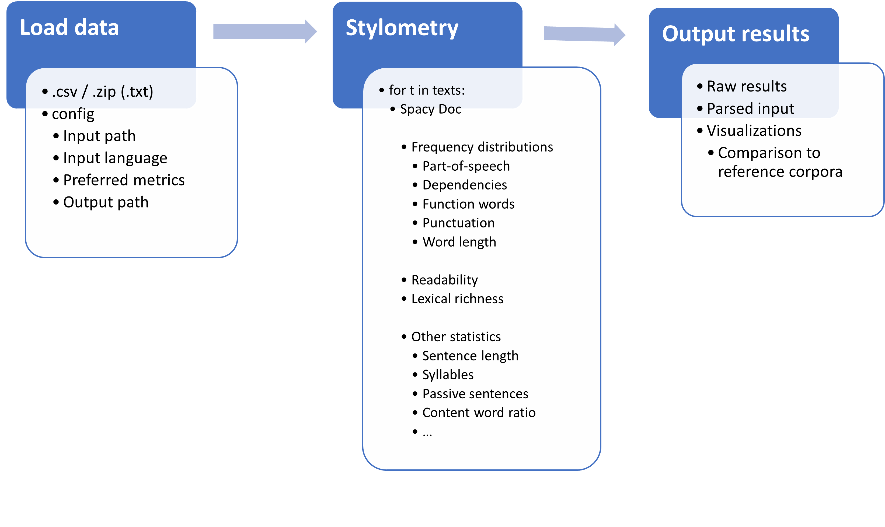

## Documentation

This repository contains the code to the CLARIAH-VL stylometry analysis pipeline.

### Installation
1. Create a new conda environment using ```conda create -n {name here} python=3.9.18```
2. Activate the environment with ```conda activate {env_name}```
3. Clone the respository: ```git clone https://github.com/LemmensJens/CLARIAH-stylo.git```
4. In this repo's home directory, install requirements with ```pip3 install -r requirements.txt```

### Quick start
1. Set up the config file.
2. Run ```python stylo.py```

### Demo
For an online demo, please visit https://stylene.uantwerpen.be/.
For a local demo of the pipeline, run ```python get_demo_data.py```, initialize the config file with ```python create_config.py```, and run ```python stylo.py```. The demo data consists of the test partition of the DBRD (Dutch Book Review Dataset).

### Pipeline overview



#### Set up the config file
In ```create_config.py```, set the input and output parameters:

1. ```input```: Full path to the input data

2. ```input_format```: Format of the input data. Can be either 'csv' for .csv files, or 'zip' for folders that contain .txt files (one per text).

3. ```text_column```: Only relevant if 'input_format' is 'csv'. Refers to the name of the column that contains the text data, default is 'text'.

4. ```delimiter```: Only relevant if 'input_format' is 'csv'. Refers to the column delimiter, default is ','.

5. ```language```: language of the input data. Default is 'Dutch', other valid options are 'English', 'French', 'German'

6. ```readability metric```: Refers to the metric used to compute readability. Default is 'RIX', other valid options are 'ARI', 'ColemanLiau', 'Flesch', 'FOG', 'Kincaid', 'LIX', 'SMOG'.

7. ```lexical diversity metric```: Refers to the metric used to compute lexical diversity. Default is "STTR", other valid options are 'TTR', 'RTTR', 'CTTR', 'Herdan', 'Summer', 'Dugast', 'Maas'.

8. ```output_dir```: folder in which the output of the pipeline is stored

9. ```overwrite_output_dir```: Boolean that decides whether the overwrite the contents of "output_dir" if this folder already exists

#### Run the pipeline
To run the pipeline, simply use the following command: ```python stylo.py```

#### Output
1. ```dependency_profile.csv```: Relative frequencies of dependencies per text.

2. ```function_word_distribution.csv```: Relative frequencies of function words per text.

3. ```length_statistics.csv```: Various statistics regarding the length of the text and words.

4. ```lexical_richness_statistics.csv```: Lexical richness score per text (cf. metric specified in the config file).

5. ```parsing_results.csv```: Parsed texts (part-of-speech tags and syntactic dependencies).

6. ```pos_profile.csv```: Relative frequencies of the part-of-speech tags used per text.

7. ```punctuation_distribution.csv```: Relative frequencies of the punctuation marks used per text.

8. ```readability_statistics.csv```: Readability score per text (cf. metric specified in the config file).

9. ```word_length_distribution.csv```: Relative distribution of word lengths per text (in number of characters).

10. ```visualizations```: Plotly visualizations of the distributions described above.

### User Guidelines
This table contains the formulas and intended usage of the different readability metrics that can be used in the pipeline:

| Metric       | Formula                                          | Language  |
|--------------|--------------------------------------------------|--------|
| ARI          | 4.71 * (characters / words) + 0.5 * (words / sentences) - 21.43 | English |
| ColemanLiau*  | 0.0588 * L - 0.296 * S - 15.8 | English;<br />Texts must be longer than 100 tokens |
| Flesch       | 206.835 - 1.015 * (words / sentences) - 84.6 * (syllables / words) | English |
| Kincaid      | 11.8 * (syllables / words) + 0.39 * (words / sentences) - 15.59 | English |
| FOG**          | 0.4 * ((words / sentences) + 100 * (complex words / words)) | English;<br />Texts must be longer than 100 syllables |
| LIX***          | (words / sentences) + (100 * (long words / words)) | Language-independant |
| RIX***          | (long words / sentences) + (words / sentences) | Language-independant;<br />More interpretable version of LIX |
| SMOG**         | 1.043 * sqrt(complex words * (30 / sentences)) + 3.1291 | English (originally developed for clinical texts);<br />Texts must be longer than 30 sentences. |

*L = Average number of characters per 100 tokens
 S = Average number of sentences per 100 tokens

**Complex words = words that contain at least 3 syllables

***Long words = words longer than 6 characters


The following table contains the formulas of the different lexical richness metrics that can be used in the pipeline. All metrics use the total number of words and the number of unique words to compute a score. We recommend using the standardized type-token ratio (STTR), as it is less prone to influence by varying text lengths.

| Metric | Formula                                         | 
|--------|-------------------------------------------------|
| TTR    | Number of unique words / Total number of words |
| STTR   | Mean of TTR scores per 100 words |
| RTTR   | Number of unique words / sqrt(Total number of words) |
| CTTR   | Number of unique words / sqrt(2 * Total number of words) |
| Herdan | log(Number of unique words) / log(Total number of words) |
| Summer | log( log(Number of unique words) ) / log( log(Total number of words) ) |
| Dugast | log(Total number of words)**2) / ( log(Total number of words) - log(Number of unique words) ) |
| Maas   | ( log(Total number of words) - log(Number of unique words) ) / log(Total number of words)**2 |


